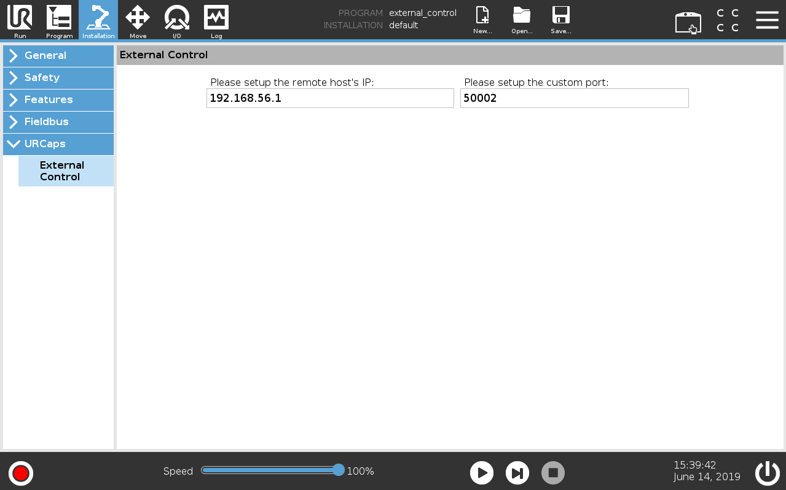
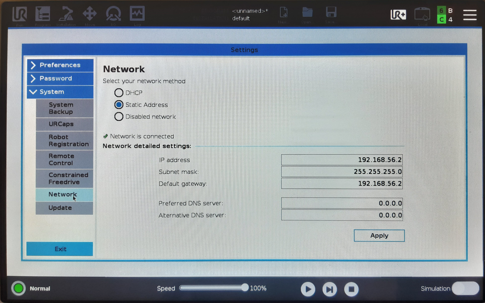
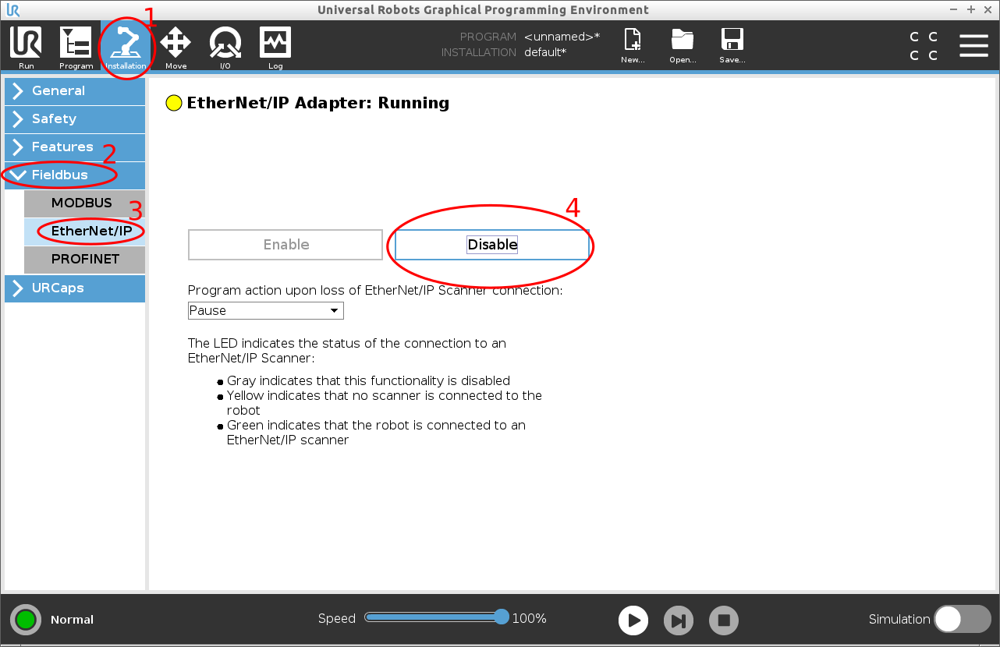
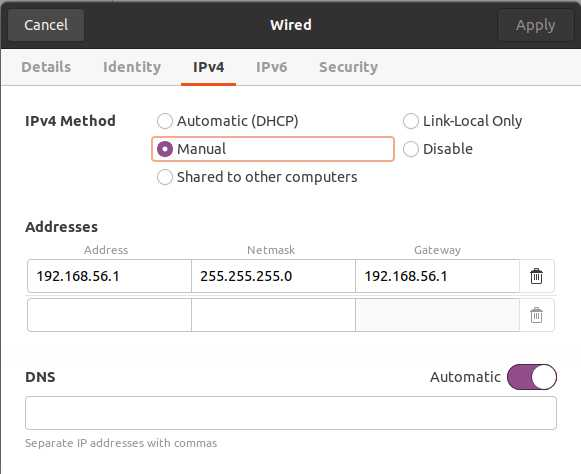
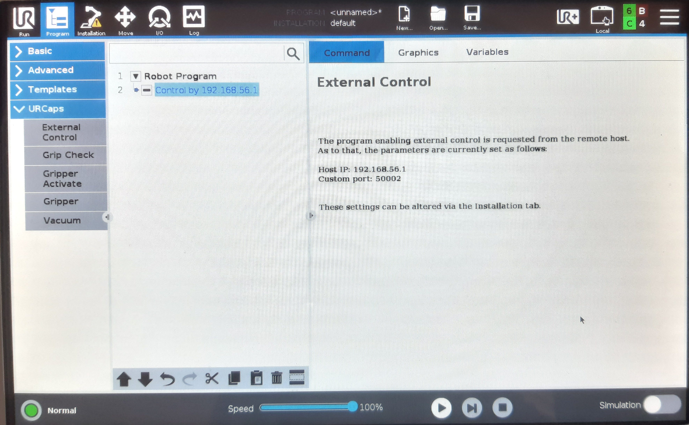

# larcc_drivers

## Table of Contents

1. [Configuration](#configuration)
2. [Installation](#installation)
3. [Controlling UR10e through MoveIt with RViz](#controlling-ur10e-through-moveit-with-rviz)
4. [Real-time UR10e following a tracked object](#real-time-ur10e-following-a-tracked-object)
5. [Gripper Remote Control](#gripper-remote-control)
6. [Real-time UR10e following & picking a tracked object](#real-time-ur10e-following-&-picking-a-tracked-object)


## Configuration

This repository was built to work with:
* UR10e manipulator (Universal Robot 10 e-series)
* Ubuntu 20.04.3 LTS
* ROS Noetic

## Installation
1. [On UR10e controller](#on-ur10e-controller)
2. [On computer](#on-computer)

### On UR10e controller 

<details>
<summary>Click for details...</summary>

For working on a real robot you need to install the [externalcontrol-1.0.5.urcap](https://github.com/lardemua/larcc_drivers/blob/master/resources/externalcontrol-1.0.5.urcap) which can be found inside the resources folder of this repository.

Using a USB pen drive, follow:
1. Format the flash drive
2. Download and save the externalcontrol-1.0.5.urcap on the USB pen drive
3. Insert the USB drive on UR10e controller (the controller has two USB ports)


4. Turn on the Teach Pendant
 


5. Click on *Menu* (top right corner) + *System* + *URCaps* + Select *External Control* and press "+"


6. Configure the remote host's IP to ```192.168.56.1```



7. Click on *Menu* (top right corner) + *System* + *Network*
8. Configure:
   1. Network method : Static Address
   2. IP address: ```192.168.56.2```
   3. Subnet mask: ```255.255.255.0```
   4. Default gateway: ```192.168.56.2```

9. Click on *Apply*



10. Disable EtherNet/IP fieldbus:

Installation > Fieldbus > EtherNet/IP > Disable



</details>


### On computer

<details>
<summary>Click for details...</summary>

First, it is required to have MoveIt and other packages installed in your system:

```
sudo apt install ros-noetic-moveit ros-noetic-industrial-robot-status-interface ros-noetic-scaled-controllers ros-noetic-pass-through-controllers ros-noetic-ur-client-library ros-noetic-ur-msgs ros-noetic-velocity-controllers ros-noetic-force-torque-sensor-controller socat
```

(**Note:** At this moment, if you do not have a catkin workspace, you should now create one, by following the steps described [here](http://wiki.ros.org/catkin/Tutorials/create_a_workspace))

After all these installations, on your catkin workspace you need to clone this repository:

```
cd catkin_ws/src
git clone https://github.com/lardemua/larcc_drivers.git
```

So that packages are able to import from each other, run the following:

```
echo "export PYTHONPATH=\$PYTHONPATH:~/catkin_ws/src/larcc_drivers" >> ~/.bashrc
source ~/.bashrc
```

troubleshooting: in case protobuf version >=3.20:

```
pip install protobuf==3.19.*
```

Now compile your catkin workspace:

```
cd ~/catkin_ws
catkin_make
```


Finally, to establish the communication between the robot and the computer, it is required to **connect an Ethernet cable from the UR10e controller to the computer**.
After you connect the cable, you need to configure the IPv4 like this:




TODO: Verify if everything below is correct.

</details>

## Controlling UR10e through MoveIt with RViz
Just need to follow these next 4 steps to remotely control the real UR10e robot, connected via the Ethernet cable to your computer.

1. ```roslaunch ur_robot_driver ur10e_bringup.launch robot_ip:=192.168.56.2 ```
2. Run the external control program on the teach pendant:

   Click on *Program* + *URCaps* + *External Control* + Press "play"



At this point, you should get the message "_Robot connected to reverse interface. Ready to receive control commands._" printed out on your terminal window.

3. ``` roslaunch ur10e_moveit_config ur10e_moveit_planning_execution.launch```

At this point, you should get the green message "_You can start planning now!_" printed out on your terminal window, just like this:


4. ``` roslaunch ur10e_moveit_config moveit_rviz.launch config:=true```


Now you can control the real robot, by simply moving the manipulator marker on RViz and then asking the robot to move to that goal (using the Motion Planning Panel).
MoveIt will plan the trajetory.

[//]: # (![tp9]&#40;docs/UR10e_moving_moveit.gif&#41;)


## Real-time UR10e following a tracked object
By using ViSP RGB-D object tracking (see [this repository](https://github.com/afonsocastro/generic-rgbd)) and MoveIt to remotely control the UR10e,
it was developed this demonstration of a real-time followed object that is being tracked with one RGB-D camera (Intel RealSense D435):


## Gripper Remote Control
In order to control the ROBOTIQ 2F-140 gripper from an external computer, it is required to:
1. Turn on the robot (UR10e)
2. Connect the TCP/IP communication between the robot and the computer
3. **Remove/Uninstall any ROBOTIQ URCap**: remove 'Robotiq_Grippers' on UR10e Teach Pendant (Click on Menu (top right corner) + System + URCaps)
4. **Install the [rs485-1.0.urcap](https://github.com/afonsocastro/larcc_interface/blob/master/resources/rs485-1.0.urcap)**. See the first 5 points of [on-ur10e-controller](#on-ur10e-controller).

Finally, for testing:

7. ```cd larcc_interface/gripper/src```

8. ```python3 test_robotiq.py ```

[//]: # (![gripper_open_close]&#40;docs/Gripper_Open_Close.gif&#41;)

[//]: # (![gripper_open_close])
<p align="center">

</p>

The Python module for controlling Robotiq 2F-140 from an external PC can be found [here](https://github.com/afonsocastro/larcc_interface/tree/master/gripper/src).

On _test_robotiq.py_, you may have to change HOST ip address to UR10e.

Notes:
1. UR10e can either be on _Remote Control_ or in _Local Control_ mode (does not make any difference).
2. It is not required to launch any robot driver. The TCP/IP connection is enough, since the RS485 communication will be directly established between the gripper and the external PC
3. It is necessary rs485 URcap. That is daemon for communicate between UR10e's rs485 network and external pc via tcp (port 54321). RobotiqHand module use this mechanism. So you must activate rs485 URCap on UR10e. And, If you activate Robotiq_Gripper URCap on UR10e, that URCap always use inner rs485 network without exclusive. This means external rs485 communication make conflict communication contents. So if you want to control 2f-140 via rs485 from external pc, you must deactivate Robotiq_Gripper URCap on UR10e
 
## Real-time UR10e following & picking a tracked object


-->
